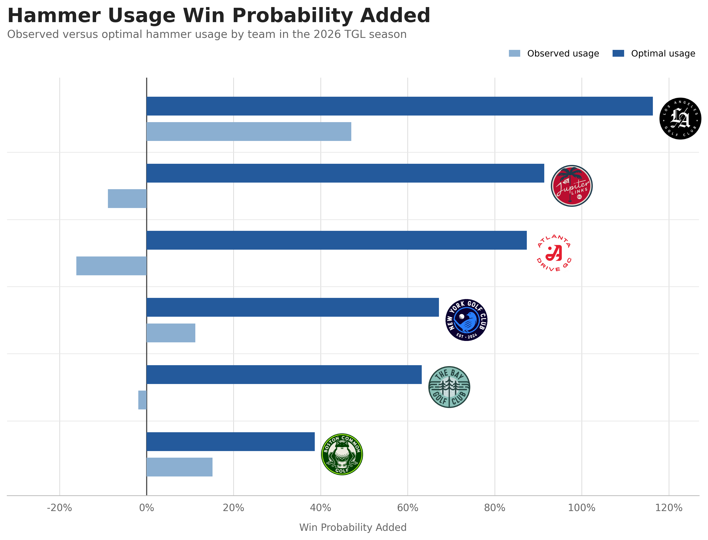

# TGL Hammer Recommendations

Optimal Hammer-Decision Recommendations for TGL Golf Teams

## Introduction

Beginning in 2025, the TMRW Golf League (TGL) features teams of professional golfers competing in matches under different scoring formats. One way in which these matches differ from traditional match play is the "hammer", which can be thrown on any hole (once per team) to potentially increase the point value of that hole by one. The other team has the option to accept the hammer with the corresponding point increase or decline it, which awards the initial point value of the hole to their opponent and moves play to the next hole. This forces teams to employ a strategy for both deploying hammers and reacting to them, and the following analysis reveals suboptimal behavior surrounding hammer usage and develops a recommendation system for optimal hammer decisions.

## Methods

Several expected strokes models (off-the-tee, approach, and putting generalized additive models (GAM) predicting the probability of finishing a hole in any given number of strokes) along with a hammer usage probability GAM comprise a match simulation framework. This Monte Carlo simulation provides the flexibility to both derive the empirical win probability added via hammers and estimate the impact of deploying or accepting/declining a hammer in a given situation. These models and simulations use shot-level data gathered from the TMRW Golf and PGA Tour websites.

## Results

By comparing the win probability of hammer decisions with the optimal decision based on the above framework, this study finds that teams fall considerably short of optimal behavior. The figure below shows the observed and optimal win probability added for TGL teams during the 2026 season when throwing or responding to a hammer. This indicates that four out of five teams left more than half a win on the table with their hammer decision-making, with a mean gap of 70% win probability added across the league.



## Conclusion

This analysis demonstrates that TGL teams do not realize as much value as they could with their hammer decision-making and derives a recommendation framework to guide when to throw hammers and how to react to hammers thrown by their opponent. Given the length of the season, the impact of this guidance could make the difference between flipping a match, making the playoffs, or winning the championship.

---

## Data and Code

```
.
├── 2025/                 # JSON objects for 2025 TGL Matches
├── 2026/                 # JSON objects for 2026 TGL Matches
├── data/                 # .csv files for drive, approach, and green shots
├── images/               # Results image
├── constants.py/         # Constants file
├── hammer_model.py/      # Code to construct hammer usage and value models
├── hole_prob_utils.py    # Utilities to help simulate hole-level results
├── hole_prob_utils.py    # Utilities to help simulate hole-level results
├── sg_utils.py           # Utilities to help generate shot-level probabilities
├── utils.py              # Functionality to map the above shot-level probabilities to a given shot
├── viz_utils.py          # Utilities to help visualize model performance, calibration, etc.
└── win_prob_utils.py     # Utilities to help simulate match-level results
```

The files in `data/` are used to construct expected stroke models that output the probability of holing out in a given number of strokes. These models are used downstream to derive hole-level win probability in the matches from the TGL JSON files.

The TGL data are used to construct models to predict the probability of a hammer being used in a given situation, along with the probability of valuable hammer usage opportunities (and the value of those opportunities).
